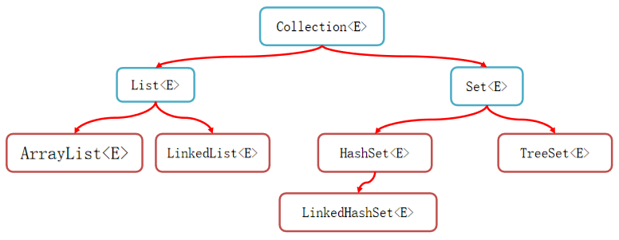
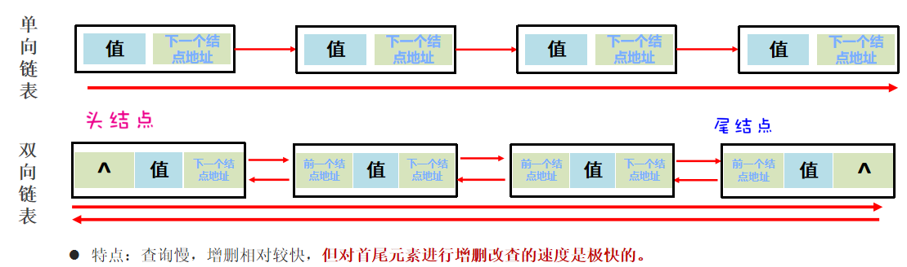
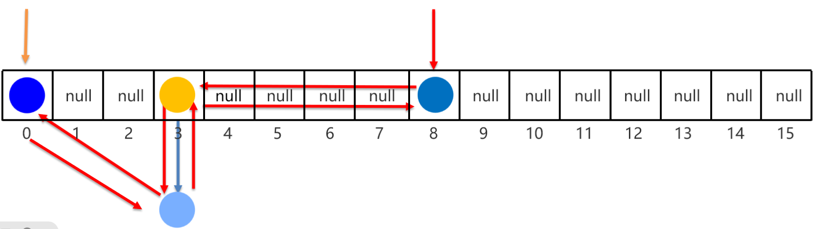
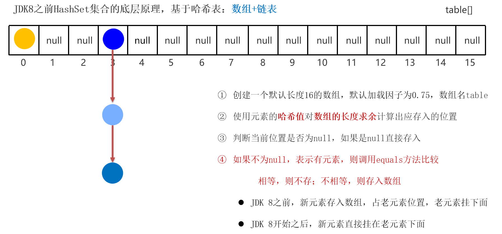
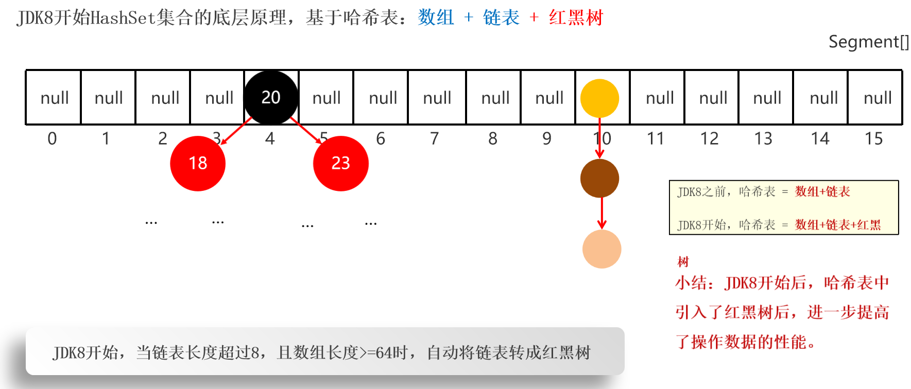
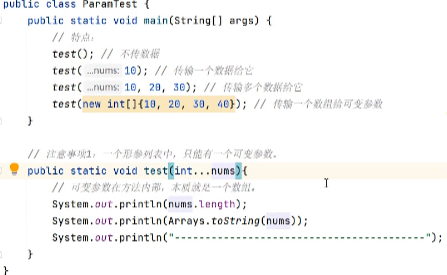
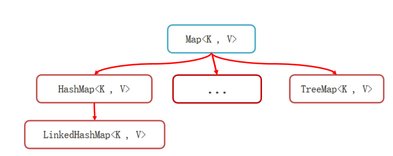

# Java

## 一、快速上手

1. JDK下载安装：[官网](https://www.oracle.com/java/technologies/downloads/)

2. [配置环境变量](https://blog.csdn.net/qq_40687540/article/details/115212035)

3. cmd常用命令

   ```java
   E:  //切换到E盘
   cd [目录]        //进入指定的目录
   cd ..         //退回到上一级目录
   cd /         //退回到根目录
   dir             //显示当前目录下所有的内容
   cls             //清空屏幕
   ```

4. Java程序中常见的问题

   - 文件名和类名不一致
   - 英文大小写错误，单词拼写错误，存在中文符号，找不到main方法
   - 括号不配对

5. JDK的组成

   

6. Java开发工具

   主推[Intellij IDEA](https://www.jetbrains.com//idea/download/#section=windows)

   常用快捷键：

   - `Ctrl + ALT + L` ：格式化代码
   - `Ctrl + /` ：单行注释
   - `Ctrl + Shift + /`：多行注释
   - `alt + insert`：快速生成构造方法
   - `sout + 回车`：创建输出方法
   - `psvm + 回车`：创建mian方法

7. Hello World

   1. 启动 IntelliJ IDEA，创建新项目（project）。
   2. 依次创建模块（module）→ 包（package） → 类（class）
   3. 编写代码，并运行

## 二、基础语法

### 2.1 变量

定义变量：数据类型 变量名称 = 数据；

eg：int age = 18；

### 2.2 数据类型


#### 2.2.1 基本数据类型

|    数据类型    | 内存占用（字节数） |             数据范围              | 默认值 |
| :------------: | :----------------: | :-------------------------------: | :----: |
|      byte      |         1          |             -128~127              |   0    |
|     short      |         2          |           -32768~32767            |   0    |
|  int（默认）   |         4          |         -2^31 ~ 2^31 - 1          |   0    |
|      long      |         8          |         -2^63 ~ 2^63 - 1          |   0    |
|     float      |         4          |      1.4E-45 ~ 3.4028235E38       |  0.0   |
| double（默认） |         8          | 4.9E-324 ~ 1.7976931348623157E308 |  0.0   |
|      char      |         2          |              0~65535              |   0    |
|    boolean     |         1          |            true/false             | false  |

```java
/* 一、整型 */
	// 1.1、byte
	byte a = 127;
	// 1.2、short
	short b = 13244;
	// 1.3、int 默认
	int c = 20;
	// 注意：随便写一个整型字面量默认为int类型
	// 1.4、long
	long d = 123456789L;
	// 注意：希望整型字面量是 long 类型，需要在后面添加l或L

/* 二、浮点型 */
	// 2.1 float
	float f = 3.14F;
	// 注意：小数字面量，默认是 double ，希望是 float 需要在后面添加f或F
	// 2.2 double 默认
	double g = 99.5;

/* 三、字符型 */
	char h = 'A';

/* 四、布尔型 */
	boolean i = true;
```

##### 2.2.1.1 类型转换

- 自动类型转换

  概念：**类型范围小**的变量可以**直接赋值**给**类型大的变量**

  ```sh
  低  ------------------------------------>  高
  
  byte,short,char—> int —> long—> float —> double 
  ```

  ```java
  /* 一、自动类型转换 */
  byte a = 12;
  int b = a;
  System.out.println(b);
  ```

- 表达式的类型转换

  概念：在表达式中，小范围类型的变量，会自动转换成表达式中较大范围的类型，再参与运算。

  注意：

  1. 表达式的最终结果类型由表达式中的**最高类型决定**；
  2. 在表达式中，**byte、short、char** 是**直接转换成int类型**参与运算。

- 强制类型转换

  概念：范围类型大的变量或数据，赋值给类型范围小的变量

  格式：数据类型 变量2 = （数据类型）变量1、数据

  快捷键：Alt+Enter

  注意：

  1. 强制类型转换可能造成数据（丢失）溢出；
  2. 浮点型强转成整型，直接丢失小数部分，保留整数部分返回。

  ```java
  /* 三、强制类型转换 */
  int i = 102;
  byte j = (byte) i;
  ```

##### 2.2.1.2 运算符

- 基本运算符

  | 符号 | 作用 |            说明            |
  | :--: | :--: | :------------------------: |
  |  +   |  加  | 与**字符串**运算可做连接符 |
  |  -   |  减  |                            |
  |  *   |  乘  |                            |
  |  /   |  除  |   整数相除的结果还是整数   |
  |  %   | 取余 |                            |

- 自增/自减/赋值运算符

  注意：扩展赋值运算符会进行强制类型转换

  ```java
  int m = 3;
  int n = 2;
  m %= n; // 等价 m = (int) (m % n)
  ```

- 关系运算符

  ​	返回布尔值

- 逻辑运算符

  | 符号 |   叫法   |       例子       |                           运算逻辑                           |
  | :--: | :------: | :--------------: | :----------------------------------------------------------: |
  |  &   |  逻辑与  |  2 > 1 & 3 > 2   | 多个条件必须都是true，结果才是true；有一个是false，结果为false |
  |  \|  |  逻辑或  |  2 > 1 \| 3 < 5  |              多个条件有一个是true，结果才是true              |
  |  !   |  逻辑非  |    ! (2 > 1)     |                             取反                             |
  |  ^   | 逻辑异或 |  2 > 1 ^ 3 > 1   |       前后结果相同，返回false；前后结果不同，返回true        |
  |  &&  |  短路与  | 2 > 10 && 3 > 2  |          判断结果与 & 一样，左边为false，右边不执行          |
  | \|\| |  短路或  | 2 > 1 \|\| 3 < 5 |          判断结果与 \| 一样，左边为true，右边不执行          |

- 三元运算符

  格式：`条件表达式 ? 值1 : 值2`

- 运算符优先级

#### 2.2.2 引用数据类型

引用类型：类、接口、数组、String默认值为null

##### 2.2.2.1 数组

1. 创建数组

   ```Java
   // 1.1 使用new 操作符: 数据类型[] 数组名 = new 数据类型[]{元素1，元素2，元素3....}
   	int[] arr1 = new int[]{1, 2, 3, 4, 5, 6, 7, 8, 9, 10};
   
   // 1.2 简化写法: 数据类型[] 数组名 = {元素1，元素2，元素3....}
   	int[] arr2 = {1, 2, 3, 4, 5, 6, 7, 8, 9, 10};
   
   // 1.3 数组的动态初始化 ：数据类型[] 数组名 = new 数据类型[长度]
   	// 定义数组时只确定数据类型和数组长度，后期赋值
   	int[] arr3 = new int[3];
   ```

2. 数组在计算机的基本原理

   数组变量存储的是数组所在的地址信息

   ```java
   System.out.println(arr); // [I@10f87f48----数组所在的地址
   ```

3. 数组的访问

   -  通过索引访问：`数组名[索引]`

   - 修改数组：`数组名[索引] = 新值`

   - 数组的长度属性：`arr.length`

4. 数组的遍历

   ```java
   // 基本循环
   int[] arr = {1, 2, 3, 4, 5, 6, 7, 8, 9, 10};
   for (int i = 0; i < arr.length; i++) {
               System.out.println(arr[i]);
           }
   
   // For-Each 循环（推荐）
   for (int i : arr) {
               System.out.println(i);
           }
   ```

5. 数组相关案例

   - 求最值

     ```java
     int[] arr = {1, 2, 3, 4, 5, 6, 7, 8, 9, 10};
     int max = arr[0];
     for (int i : arr) {
         if (i > max) {
             max = i;
         }
     }
     System.out.println(max);
     ```

   - 求和

   - 数组反转


### 2.3 语句

#### 2.3.1 分支结构

##### 2.3.1.1 if

- if 语句

  ```java
  if(布尔表达式)
  {
     //如果布尔表达式为true将执行的语句
  }
  ```

  注意：如果if语句只有一行代码，{} 可省略，但不推荐

- if...else语句

  ```java
  if(布尔表达式){
     //如果布尔表达式的值为true
  }else{
     //如果布尔表达式的值为false
  }
  ```

- if...else if...else 语句

  ```java
  if(布尔表达式 1){
     //如果布尔表达式 1的值为true执行代码
  }else if(布尔表达式 2){
     //如果布尔表达式 2的值为true执行代码
  }else if(布尔表达式 3){
     //如果布尔表达式 3的值为true执行代码
  }else {
     //如果以上布尔表达式都不为true执行代码
  }
  ```

##### 2.3.1.2 switch

```java
switch(expression){
    case value :
       //语句
       break; //可选
    case value :
       //语句
       break; //可选
    //你可以有任意数量的case语句
    default : //可选
       //语句
}
// expression即变量；value对应的值
```

注意：switch 语句中的变量类型可以是： **byte、short、int 或者 char**。从 Java SE 7 开始，switch 支持字符串 String 类型了，同时 case 标签必须为字符串常量或字面量。

利用 switch 穿透 简化代码（见 B 和 C）；场景：case内代码相同

```java
public class Test {
   public static void main(String args[]){
      //char grade = args[0].charAt(0);
      char grade = 'C';
 
      switch(grade)
      {
         case 'A' :
            System.out.println("优秀"); 
            break;
         case 'B' :
         case 'C' :
            System.out.println("良好");
            break;
         case 'D' :
            System.out.println("及格");
            break;
         case 'F' :
            System.out.println("你需要再努力努力");
            break;
         default :
            System.out.println("未知等级");
      }
      System.out.println("你的等级是 " + grade);
   }
}
```

#### 2.3.2 循环结构

##### 2.3.2.1 for

```java
for(初始化; 布尔表达式; 更新) {
    //代码语句
}
```

示例：

```java
public class Test {
   public static void main(String[] args) {
 
      for(int i = 10; i < 20; i++) {
         System.out.print("value of i : " + i );
         System.out.print("\n");
      }
   }
}
```

##### 2.3.2.2 while

```java
while( 布尔表达式 ) {
  //循环内容
}
```

注意：只要**布尔表达式为 true**，循环就会一直执行下去。

示例：

```java
public class Test {
   public static void main(String[] args) {
      int i = 10;
      while( i < 20 ) {
         System.out.print("value of i : " + i );
         i++;
         System.out.print("\n");
      }
   }
}
```

##### 2.3.2.3 do-while

对于 while 语句而言，如果不满足条件，则不能进入循环，do…while 循环至少会执行一次。布尔表达式为 true，循环会一直执行。

```java
do {
       //代码语句
}while(布尔表达式);
```

示例：

```java
public class Test {
   public static void main(String[] args){
      int x = 10;
 
      do{
         System.out.print("value of x : " + x );
         x++;
         System.out.print("\n");
      }while( x < 20 );
   }
}
```

#### 2.3.3 跳转关键字

- break

  主要用在循环语句或者 switch 语句中，用来跳出整个语句块，并且继续执行该循环下面的语句。

- continue

  用于任何循环控制结构中。作用是让程序立刻跳转到下一次循环的迭代。

### 2.4 方法

#### 2.4.1 定义

```Java
修饰符 返回值类型 方法名(参数类型 参数名){
    ...
    方法体
    ...
    return 返回值;
}
```


#### 2.4.2 执行原理

方法被调用的时候，是进入到**栈内存**中运行。

栈：先进后出，用完即弃

#### 2.4.3 方法参数传递机制

以值传递，基本类型的参数传输**存储的数据值**；引用类型的参数传输**存储的地址值**。

#### 2.4.4 方法重载

定义：一个类中，出现多个方法的**名称相同**，但是他们的**形参列表不同**，Java编译器根据方法签名判断哪个方法应该被调用。

应用场景：处理一类业务，提供多种方案

## 三、面向对象

### 3.1 OOP概述

面向对象编程（Object-Oriented Programming，OOP）是一种程序设计方法，其核心思想是将问题抽象为由若干个对象，通过这些对象之间的调用、配合及协调，共同完成当前的问题。

面向对象的三大基本特征：封装、继承和多态。

面向对象的五大基本原则：单一职责原则、开放封闭原则、里氏替换原则、接口隔离原则、依赖反转原则。

对象在计算机中的执行原理

### 3.2 构造器与this

构造器：

- 构造器名和类名相同，没有返回值
- 调用构造方法，必须用 `new` 操作符，常用于完成对象初始化
- 如果不写构造器，Java会为类自动生成一个无参构造器
- 一旦定义了有参构造器，Java就不会帮我们的类生成无参构造器了，建议自己手写一个无参构造器

this关键字：this指向当前对象

```java
// 定义Student类
public class Student {
    String name;
    double chinese;
    double math;
    // 构造器
    public Student() {
        System.out.println("无参数构造器触发执行");
    }
    // 有参数构造器
    public Student(String name,double chinese,double math) {
        this.name = name;
        this.chinese=chinese;
        this.math=math;
        System.out.println("有参数构造器触发执行");
    }
}
// 测试
public class Test {
    public static void main(String[] args) {
        Student s1 = new Student(); // 无参数构造器触发执行
        Student s2 = new Student("张三",99,100); // 有参数构造器触发执行
    }
}
```

### 3.3 封装 & JavaBean

封装是面向对象编程的基本原则之一，它指的是将数据和操作数据的方法封装在一个单元内，即一个类中。封装通过访问控制修饰符（如private、protected、public）来限制对类的成员的访问。

实体类：只负责数据存取，而对数据的处理交给其他类来完成，以实现数据和数据业务处理相分离；成员变量必须私有，且要为他们提供get、set方法；必须有无参数构造器。

封装实体类：

```java
public class Student {
    // private 隐藏成员 public 公开成员

    /* 1、必须私有成员 */
    private String name;
    private double score;

    /* 2、为每个成员变量提供get、set方法 */
    // 快捷键：右键菜单 → 生成 → Getter和Setter → shift键多选
    public String getName() {
        return name;
    }

    public void setName(String name) {
        this.name = name;
    }

    public double getScore() {
        return score;
    }

    public void setScore(double score) {
        this.score = score;
    }

    /* 3、必须为类提供一个公开的无参数构造器 */
    // 快捷键：右键菜单 → 生成 → 构造函数 → → shift键多选
    public Student() {
    }
    public Student(String name, double score) {
        this.name = name;
        this.score = score;
    }
    
}
```

封装操作类：

```java
public class StudentOperator {
    private Student student;
    public StudentOperator(Student student) {
        this.student = student;
    }

    public void printPass() {
        if (student.getScore() >= 60) {
            System.out.println(student.getName() + "学生成绩及格");
        } else {
            System.out.println(student.getName() + "学生成绩不及格");
        }
    }
}
```

实体类与操作类使用：

```java
public class Test {
    public static void main(String[] args) {
        // 实体类保存数据
        Student s1 = new Student("张三", 59);
        // 操作类处理业务需求
        StudentOperator operator = new StudentOperator(s1);
        operator.printPass();
    }
}
```

### 3.4 static

静态，可修饰成员变量、方法。

成员变量按照有无static修饰，分为两种

- 类变量：有static修饰，类所持有且唯一，可被对象访问
- 实例变量：无static修饰，对象所持有，只能由对象访问

```java
public class Student {
    // 类变量
    static String name;
    // 实例变量
    int age;
}

public class Test {
    public static void main(String[] args) {
        Student s1=new Student();
        Student s2=new Student();
        // 类变量的访问---通过类名访问
        Student.name="张三";
        // s1.name 不推荐
        // s2.name 不推荐
    }
}
```

类变量的应用场景：数据只需要一份，且需要被共享时（访问，修改）。

Tip：在同一个类中访问类变量，可省略类名不写。

修饰成员方法与变量类似。

工具类：如果一个类中的方法全都是静态的，那么这个类中的方法就全都可以被类名直接调用，由于调用起来非常方便，就像一个工具一下，所以把这样的类就叫做工具类。推荐用类名调用为了防止使用者用对象调用。我们可以把工具类的构造方法私有化。

注意：

- 类方法可以直接访问类的成员，不可以访问实例成员
- 实例方法中可以访问类成员
- 类方法不可出现this

代码块：代码块是类的五大成分之一（成员变量、构造器、方法、代码块、内部类）

- 静态代码块

  格式：`static { }`

  特点：随着类的加载而执行，而且只执行一次

  作用：完成对象的初始化，类变量初始化，类似构造器

- 实例代码块

  格式：`{ }`

  特点：每次创建对象之前会执行实例代码块且在构造器之前

  作用：完成对象的初始化类，实例变量初始化，似构造器

单例设计模式：确保一个类只有一个对象。

写法：

- ```java
  // 饿汉式单例：拿到对象时，对象已经创建好了
  public class A {
      // 1、构造器私有化
      private A(){}
  
      // 2、定义一个类变量存储类的一个对象
      private static A a = new A();
  
      // 3、定义一个类方法，返回对象
      public static A getInstance(){
          return a;
      }
  }
  // 懒汉式单例：拿对象时，才开始创建对象
  public class A {
      // 1、构造器私有化
      private A(){}
  
      // 2、定义一个类变量存储类的一个对象
      private static A a;
  
      // 3、定义一个类方法，这个方法要保证第一次调用时才创建一个对象，后面调用时都会用这同一个对象返回
      public static A getInstance() {
          if (a == null) {
              a = new A();
          }
          return a;
      }
  }
  ```

### 3.5 继承

概述

- 通过extends关键字，建立类与类的父子关系
- 子类可以继承父类私有成员
- 子类对象由子、父类共同完成
- Java语言只支持单继承，不支持多继承，但是可以多层继承
- Java默认直接或间接继承Object类（祖宗类）

权限修饰符：用来限制类中的成员能够被访问的范围

|  修饰符   | 在本类中 | 同一个包下的其他类里 | 任意包下的子类里 | 任意包下的任意类里 |
| :-------: | :------: | :------------------: | :--------------: | :----------------: |
|  private  |    ✔     |                      |                  |                    |
|   缺省    |    ✔     |          ✔           |                  |                    |
| protected |    ✔     |          ✔           |        ✔         |         ✔          |
|  public   |    ✔     |          ✔           |        ✔         |         ✔          |

方法重写：当子类觉得父类中的某个方法不好用，或者无法满足自己的需求时，子类可以重写一个方法名称、参数列表一样的方法，去覆盖父类的这个方法。

方法重写注意事项：

- 重写后，方法的访问，Java会遵循就近原则

- 使用Override注解，他可以指定java编译器，检查我们方法重写的格式是否正确，代码可读性也会更好。

  ```java
  @Override
  ```

- 子类重写父类方法时，访问权限必须大于或者等于父类该方法的权限（ public > protected > 缺省 ）

- 重写的方法返回值类型，必须与被重写方法的返回值类型一样，或者范围更小

- 私有方法、静态方法不能被重写，如果重写会报错的

子类访问父类成员变量及方法：`super.父类成员变量/父类成员方法`

子类构造器特点：

- 子类的全部构造器，都会先调用父类的构造器，再执行自己
- 默认情况下，子类全部构造器的第一行代码都是 super() （写不写都有） ，它会调用父类的无参数构造器
- 如果父类没有无参数构造器，则我们必须在子类构造器的**第一行**手写super(….)，指定去调用父类的有参数构造器
- 任意类的构造器中，是可以通过this(…) 去调用该类的其他构造器

注意：this(…)和super(…)必须放在构造器的第一行。

### 3.6 多态

概述：多态是在继承/实现情况下的一种现象，表现为：对象多态、行为多态

```java
People p1 = new Student();

People p2 = new Teacher();
```

类型转换

- 自动类型转换：`父类 变量名 = new 子类()`

  ```java
  People p = new Teacher();
  ```

- 强制类型转换：`子类 变量名 = (子类) 父类变量`

  ```java
  Teacher t = (Teacher)p;
  ```

注意

- 多态下不能使用子类的独有功能
- 使用`instanceof`关键字，判断当前对象的真实类型，再进行强转

### 3.7 final

概述：

- final 关键字是最终的意思，可以修饰（类、方法、变量）
- 修饰类：该类被称为最终类，特点是不能被继承了
- 修饰方法：该方法被称为最终方法，特点是不能被重写了
- 修饰变量：该变量只能被赋值一次，被称为常量
  - final修饰基本类型的变量，变量存储的数据不能被改变
  - final修饰引用类型的变量，变量存储的地址不能被改变，但地址所指向对象的内容是可以被改变的
  - 常量名的命名规范：建议使用大写英文单词，多个单词使用下划线连接起来

```java
//  声明类
final class 类名 {//类体}
// 声明方法
修饰符(public/private/default/protected) final 返回值类型 方法名(){//方法体}
```

### 3.8 abstract

概述

- 抽象类最主要的特点：抽象类不能创建对象，仅作为一种特殊的父类，让子类继承并实现

- 抽象类中不一定有抽象方法，有抽象方法的类一定是抽象类

- 类该有的成员（成员变量、方法、构造器）抽象类都可以有

- 一个类继承抽象类，必须重写完抽象类的全部抽象方法，否则这个类也必须定义成抽象类

- ```java
  修饰符 abstract class 类名{ 
      // 抽象方法：必须abstract修饰，只有方法签名，不能有方法体。 
  	修饰符 abstract 返回值类型 方法名称(形参列表)；
   }
  ```

### 3.9 接口

概述：接口并不是类，编写接口的方式和类很相似，但是它们属于不同的概念。类描述对象的属性和方法。接口则包含类要实现的方法。

### 3.10 内部类

概述：如果一个类定义在另一个类的内部，这个类就是内部类。

场景：当一个类的内部，包含了一个完整的事物，且这个事物没有必要单独设计时，就可以把这个事物设计成内部类。

### 3.11 枚举

概述：枚举是一个特殊的类，一般表示一组常量。

```java
修饰符 enum 枚举类名{
	   名称1 ,  名称2, ... ; 
       其他成员…
  }
```

### 3.12 泛型

概述：定义类、接口、方法时，同时声明了一个或者多个类型变量（如：`<E>`） ，称为泛型类、泛型接口，泛型方法、它们统称为泛型。

## 四、常用API

### 4.1 包

包是用来分门别类的管理各种不同程序的，类似于文件夹，建包有利于程序的管理和维护。

建包的语法格式：

```java
package com.demo.oop;
public class Test {
}
```

在自己程序中调用其他包下的程序的注意事项：

- 同一个包下的类，互相可以直接调用；
- 如果当前程序中，要调用其他包下的程序，则必须在当前程序中导包, 才可以访问！导包格式：`import 包名.类名`;
- 如果当前程序中，要调用Java提供的程序，也需要先导包才可以使用；但是Java.lang包下的程序是不需要我们导包的，可以直接使用；
- 如果当前程序中，要调用多个不同包下的程序，而这些程序名正好一样，此时默认只能导入一个程序，另一个程序必须带包名访问。

```java
package com.itheima.pkg;
import com.itheima.pkg.itcast.Demo1;
import com.itheima.pkg.itheima.Demo2;
import java.util.Random;
import java.util.Scanner;

public class Test {
    public static void main(String[] args) {
        // 1、同一个包下的程序，可以直接访问。
        Demo d = new Demo();
        d.print();

        // 2、访问其他包下的程序，必须导包才可以访问。
        Demo1 d2 = new Demo1();
        d2.print();

        // 3、自己的程序中调用Java提供的程序，也需要先导包才可以使用；注意：Java.lang包下的程序是不需要我们导包的，可以直接使用。
        Scanner sc = new Scanner(System.in);
        String s = "黑马";
        Random r = new Random();

        // 4、访问多个其他包下的程序，这些程序名又一样的情况下，默认只能导入一个程序，另一个程序必须带包名和类名来访问。
        Demo2 d3 = new Demo2();
        d3.print();

        com.itheima.pkg.itcast.Demo2 d4 = new com.itheima.pkg.itcast.Demo2();
        d4.print();
    }
}
```

### 4.2 String

#### 4.2.1 创建

```java
// 1、直接字面量创建
String str1 = "Hello World";
        
// 2、new String创建字符串对象，并调用构造器初始化字符串
String str2 = new String(); // ""

String str3 = new String("Hello World");

char[] charArr = {'h', 'e', 'l', 'l', 'o'};
String str4 = new String(charArr);

byte[] byteArr = {1, 2, 3, 4, 5};
String str5 = new String(byteArr);
```

#### 4.2.2 常用方法

```java
String str = "Hello World";
// 1、length()
// 获取字符串的长度
int s1 = str.length(); // 10

// 2、charAt(int index)
// 获取某个索引位置处的字符
char s2 = str.charAt(0); // H

// 3、toCharArray()
// 将当前字符串转换成字符数组返回
char[] s3 = str.toCharArray();

// 4、equals(Object anObject)
// 判断当前字符串与另一个字符串的内容一样，一样返回true
String s4 = new String("hello");
String s5 = new String("hello");
Boolean flag1 = s4 == s5; // false
Boolean flag2 = s4.equals(s5); // true

// 5、equalsIgnoreCase(String anotherString)
// 忽略大小写比较字符串类容
String s6 = "hello";
String s7 = "Hello";
Boolean flag3 = s6.equalsIgnoreCase(s7); // true

// 6、substring(int beginIndex, int endIndex)
// 根据开始和结束索引进行截取，得到新的字符串（包前不包后）
String s8 = str.substring(0, 4); // Hell

// 7、substring(int beginIndex)
// 从传入的索引处截取，截取到末尾，得到新的字符串返回
String s9 = str.substring( 4); // o World

// 8、replace(CharSequence target, CharSequence replacement)
// 使用新值，将字符串中的旧值替换，得到新的字符串
String s10 = str.replace("Hello","**"); // ** World

// 9、contains(CharSequence s)
// 判断字符串中是否包含了某个字符串
Boolean falg4 = str.contains("H"); // true

// 10、startsWith(String prefix)
// 判断字符串是否以某个字符串内容开头
Boolean falg5 = str.startsWith("H"); // true

// 11、split(String regex)
// 把字符串按照某个字符串内容分割，并返回字符串数组回来
String[] s11 =str.split(",");
```

#### 4.2.3 注意事项

- String是不可变字符串对象；

- 只要是以“...”方式写出的字符串对象，会存储到字符串常量池，且相同内容的字符串只存储一份；
- 通过new方式创建字符串对象，每new一次都会产生一个新的对象放在堆内存中。

### 4.3 ArrayList

#### 4.3.1 概述 & 创建

概述：

- ArrayList属于集合的一种。

- 集合是一种容器，用来装数据的，类似于数组，集合相比于数组大小可变。

创建ArrayList对象：

```java
ArrayList<T> list = new ArrayList<>();
```

#### 4.3.2 常用方法

```java
// 创建一个ArrayList的集合对象
ArrayList<String> list = new ArrayList<>();

// 1、add(E e)
// 将指定的元素添加到此集合的末尾
list.add("A");
list.add("B");
list.add("C");

// 2、add(int index,E element)
// 在此集合中的指定位置插入指定的元素
list.add(2,"D");

// 3、get(int index)
// 返回指定索引处的元素
String str = list.get(1);

// 4、size()
// 返回集合中的元素的个数
int num = list.size();

// 5、remove(int index)
// 删除指定索引处的元素，返回被删除的元素
list.remove(1);

// 6、remove(Object o)
// 删除指定的元素，返回删除是否成功(默认删除第一个出现的元素)
list.remove("B");

// 7、set(int index,E element)
// 修改指定索引处的元素，返回被修改的元素
list.set(1,"G");
```

### 4.4 Object & Objects

Object类是Java中所有类的祖宗类，因此，Java中所有类的对象都可以直接使用Object类中提供的一些方法。

|             方法名              |           说明           |
| :-----------------------------: | :----------------------: |
|    public String toString()     | 返回对象的字符串表示形式 |
| public boolean equals(Object o) |   判断两个对象是否相等   |
|    protected Object clone()     |          浅克隆          |

Objects是一个工具类，提供了很多操作对象的静态方法给我们使用。

|                      方法名                      |                      说明                      |
| :----------------------------------------------: | :--------------------------------------------: |
| public static boolean equals(Object a, Object b) |          先做非空判断，再比较两个对象          |
|     public static boolean isNull(Object obj)     |    判断对象是否为null，为null返回true ,反之    |
|    public static boolean nonNull(Object obj)     | 判断对象是否不为null，不为null则返回true, 反之 |

使用Objects类提供的equals方法来比较两个对象更安全

### 4.5 包装类

### 4.6 StringBuilder、StringBuffer

### 4.7 StringJoiner

### 4.8 Math

```java
// 1、public static int abs(int a)：取绝对值（拿到的结果一定是正数）
// public static double abs(double a)
System.out.println(Math.abs(-12)); // 12
System.out.println(Math.abs(-3.14)); // 3.14

// 2、public static double ceil(double a): 向上取整
System.out.println(Math.ceil(4.0000001)); // 5.0
System.out.println(Math.ceil(4.0)); // 4.0

// 3、public static double floor(double a): 向下取整
System.out.println(Math.floor(4.999999)); // 4.0
System.out.println(Math.floor(4.0)); // 4.0

// 4、public static long round(double a)：四舍五入
System.out.println(Math.round(3.4999)); // 3
System.out.println(Math.round(3.50001)); // 4

// 5、public static int max(int a, int b)：取较大值
//   public static int min(int a, int b)：取较小值
System.out.println(Math.max(10, 20)); // 20
System.out.println(Math.min(10, 20)); // 10

// 6、 public static double pow(double a, double b)：取次方
System.out.println(Math.pow(2, 3)); // 2的3次方   8.0
System.out.println(Math.pow(3, 2)); // 3的2次方   9.0

// 7、public static double random()： 取随机数 [0.0 , 1.0) (包前不包后)
System.out.println(Math.random());
```

### 4.9 System

```java
// 1、public static void exit(int status):
//   终止当前运行的Java虚拟机。
//   该参数用作状态代码; 按照惯例，非零状态代码表示异常终止。
System.exit(0); // 人为的终止虚拟机。(不要使用)

// 2、public static long currentTimeMillis():
//    获取当前系统的时间
//    返回的是long类型的时间毫秒值：指的是从1970-1-1 0:0:0开始走到此刻的总的毫秒值，1s = 1000ms
long time = System.currentTimeMillis();
System.out.println(time);
```

### 4.10 Runtime

Runtime是一个单例类，代表程序所在的运行环境。

```java
// 1、public static Runtime getRuntime() 返回与当前Java应用程序关联的运行时对象。
Runtime r = Runtime.getRuntime();

// 2、public void exit(int status) 终止当前运行的虚拟机,该参数用作状态代码; 按照惯例，非零状态代码表示异常终止。
// r.exit(0);

// 3、public int availableProcessors(): 获取虚拟机能够使用的处理器数。
System.out.println(r.availableProcessors());

// 4、public long totalMemory() 返回Java虚拟机中的内存总量。
System.out.println(r.totalMemory()/1024.0/1024.0 + "MB"); // 1024 = 1K     1024 * 1024 = 1M

// 5、public long freeMemory() 返回Java虚拟机中的可用内存量
System.out.println(r.freeMemory()/1024.0/1024.0 + "MB");

// 6、public Process exec(String command) 启动某个程序，并返回代表该程序的对象。
// r.exec("D:\\soft\\XMind\\XMind.exe");
Process p = r.exec("QQ");
Thread.sleep(5000); // 让程序在这里暂停5s后继续往下走！！
p.destroy(); // 销毁！关闭程序！
```

### 4.11 BigDecimal

解决浮点型运算时，出现结果失真的问题

```java
double a = 0.1;
double b = 0.2;

// 1、把浮点型数据封装成BigDecimal对象，再来参与运算。
// a、public BigDecimal(double val) 得到的BigDecimal对象是无法精确计算浮点型数据的。 注意：不推荐使用这个，
// b、public BigDecimal(String val)  得到的BigDecimal对象是可以精确计算浮点型数据的。 可以使用。
// c、public static BigDecimal valueOf(double val): 通过这个静态方法得到的BigDecimal对象是可以精确运算的。是最好的方案。
BigDecimal a1 = BigDecimal.valueOf(a);
BigDecimal b1 = BigDecimal.valueOf(b);

// 2、public BigDecimal add(BigDecimal augend): 加法
BigDecimal c1 = a1.add(b1);
System.out.println(c1);

// 3、public BigDecimal subtract(BigDecimal augend): 减法
BigDecimal c2 = a1.subtract(b1);
System.out.println(c2);

// 4、public BigDecimal multiply(BigDecimal augend): 乘法
BigDecimal c3 = a1.multiply(b1);
System.out.println(c3);

// 5、public BigDecimal divide(BigDecimal b): 除法
BigDecimal c4 = a1.divide(b1);
System.out.println(c4);

// BigDecimal d1 = BigDecimal.valueOf(0.1);
// BigDecimal d2 = BigDecimal.valueOf(0.3);
// BigDecimal d3 = d1.divide(d2);
// System.out.println(d3);

// 6、public BigDecimal divide(另一个BigDecimal对象，精确几位，舍入模式) : 除法，可以设置精确几位。
BigDecimal d1 = BigDecimal.valueOf(0.1);
BigDecimal d2 = BigDecimal.valueOf(0.3);
BigDecimal d3 = d1.divide(d2,  2, RoundingMode.HALF_UP); // 0.33
System.out.println(d3);

// 7、public double doubleValue() : 把BigDecimal对象又转换成double类型的数据。
// print(d3);
// print(c1);
double db1 = d3.doubleValue();
double db2 = c1.doubleValue();
print(db1);
print(db2);
```

### 4.12 日期时间

#### 1、jdk8之前的时间

- Date

  ```java
  // 1、创建一个Date的对象：代表系统当前时间信息的。
  Date d = new Date();
  System.out.println(d); // Thu Sep 12 10:04:18 CST 2024
  
  // 2、拿到时间毫秒值。
  long time = d.getTime();
  System.out.println(time); // 1726106658257
  
  // 3、把时间毫秒值转换成日期对象
  Date d2 = new Date(time);
  System.out.println(d2); // Thu Sep 12 10:04:18 CST 2024
  
  // 4、直接把日期对象的时间通过setTime方法进行修改
  Date d3 = new Date();
  d3.setTime(time);
  System.out.println(d3); // Thu Sep 12 10:04:18 CST 2024
  ```

- SimpleDateFormat

  ```java
  // 准备一些时间
  Date d = new Date(); // Wed Oct 30 09:47:04 CST 2024
  long time = d.getTime(); // 1730252844925
  
  // 1、格式化日期对象，和时间 毫秒值。
  SimpleDateFormat sdf = new SimpleDateFormat("yyyy年MM月dd日 HH:mm:ss EEE a");
  
  String rs = sdf.format(d); // 2024年10月30日 09:48:06 周三 上午
  String rs2 = sdf.format(time); // // 2024年10月30日 09:48:06 周三 上午
  
  // 2、解析字符串时间 成为日期对象。
  String dateStr = "2022-12-12 12:12:11";
  // 创建简单日期格式化对象 , 指定的时间格式必须与被解析的时间格式一模一样，否则程序会出bug.
  SimpleDateFormat sdf2 = new SimpleDateFormat("yyyy-MM-dd HH:mm:ss");
  Date d2 = sdf2.parse(dateStr); // Mon Dec 12 12:12:11 CST 2022
  ```

- Calendar

  ```java
  // 1、得到系统此刻时间对应的日历对象。
  Calendar now = Calendar.getInstance();
  System.out.println(now); // java.util.GregorianCalendar[time=1730253104506....
  
  // 2、获取日历中的某个信息
  int year = now.get(Calendar.YEAR);
  System.out.println(year); // 2024
  
  int days = now.get(Calendar.DAY_OF_YEAR); // 获取一年中的第多少天
  System.out.println(days); // 304
  
  // 3、拿到日历中记录的日期对象。
  Date d = now.getTime();
  System.out.println(d); // Wed Oct 30 09:51:44 CST 2024
  
  // 4、拿到时间毫秒值
  long time = now.getTimeInMillis();
  System.out.println(time); // 1730253104506
  
  // 5、修改日历中的某个信息
  now.set(Calendar.MONTH, 9); // 修改月份成为10月份。
  now.set(Calendar.DAY_OF_YEAR, 125); // 修改成一年中的第125天。
  System.out.println(now); // ....
  
  // 6、为某个信息增加或者减少多少
  now.add(Calendar.DAY_OF_YEAR, 100);
  now.add(Calendar.DAY_OF_YEAR, -10);
  now.add(Calendar.DAY_OF_MONTH, 6);
  now.add(Calendar.HOUR, 12);
  now.set(2026, 11, 22);
  System.out.println(now); // ....
  ```

#### 2、jdk8新增时间

JDK8之前传统的时间API，都是可变对象，修改后会丢失最开始的时间信息；

JDK8开始之后新增的时间API，都是不可变对象，修改后会返回新的时间对象，不会丢失最开始的时间。

- LocalDate：年、月、日

  ```java
  // 0、获取本地日期对象(不可变对象)
  LocalDate ld = LocalDate.now(); // 年 月 日
  System.out.println(ld); // 2024-10-30
  
  // 1、获取日期对象中的信息
  int year = ld.getYear(); // 年
  System.out.println(year); // 2024
  
  int month = ld.getMonthValue(); // 月(1-12)
  System.out.println(month); // 10
  
  int day = ld.getDayOfMonth(); // 日
  System.out.println(day); // 30
  
  int dayOfYear = ld.getDayOfYear();  // 一年中的第几天
  System.out.println(dayOfYear); // 304
  
  int dayOfWeek = ld.getDayOfWeek().getValue(); // 星期几
  System.out.println(dayOfWeek); // 3
  
  // 2、直接修改某个信息: withYear、withMonth、withDayOfMonth、withDayOfYear
  LocalDate ld2 = ld.withYear(2099);
  LocalDate ld3 = ld.withMonth(12);
  System.out.println(ld2); // 2099-10-30
  System.out.println(ld3); // 2024-12-30
  System.out.println(ld); // 2024-10-30
  
  // 3、把某个信息加多少: plusYears、plusMonths、plusDays、plusWeeks
  LocalDate ld4 = ld.plusYears(2);
  LocalDate ld5 = ld.plusMonths(2);
  
  // 4、把某个信息减多少：minusYears、minusMonths、minusDays、minusWeeks
  LocalDate ld6 = ld.minusYears(2);
  LocalDate ld7 = ld.minusMonths(2);
  
  // 5、获取指定日期的LocalDate对象： public static LocalDate of(int year, int month, int dayOfMonth)
  LocalDate ld8 = LocalDate.of(2099, 12, 12);
  LocalDate ld9 = LocalDate.of(2099, 12, 12);
  
  // 6、判断2个日期对象，是否相等，在前还是在后： equals isBefore isAfter
  System.out.println(ld8.equals(ld9));// true
  System.out.println(ld8.isAfter(ld)); // true
  System.out.println(ld8.isBefore(ld)); // false
  ```

- LocalTime：时、分、秒

  ```java
  // 0、获取本地时间对象
  LocalTime lt = LocalTime.now(); // 时 分 秒 纳秒 不可变的
  System.out.println(lt);
  
  // 1、获取时间中的信息
  int hour = lt.getHour(); //时
  int minute = lt.getMinute(); //分
  int second = lt.getSecond(); //秒
  int nano = lt.getNano(); //纳秒
  
  // 2、修改时间：withHour、withMinute、withSecond、withNano
  LocalTime lt3 = lt.withHour(10);
  LocalTime lt4 = lt.withMinute(10);
  LocalTime lt5 = lt.withSecond(10);
  LocalTime lt6 = lt.withNano(10);
  
  // 3、加多少：plusHours、plusMinutes、plusSeconds、plusNanos
  LocalTime lt7 = lt.plusHours(10);
  LocalTime lt8 = lt.plusMinutes(10);
  LocalTime lt9 = lt.plusSeconds(10);
  LocalTime lt10 = lt.plusNanos(10);
  
  // 4、减多少：minusHours、minusMinutes、minusSeconds、minusNanos
  LocalTime lt11 = lt.minusHours(10);
  LocalTime lt12 = lt.minusMinutes(10);
  LocalTime lt13 = lt.minusSeconds(10);
  LocalTime lt14 = lt.minusNanos(10);
  
  // 5、获取指定时间的LocalTime对象：
  // public static LocalTime of(int hour, int minute, int second)
  LocalTime lt15 = LocalTime.of(12, 12, 12);
  LocalTime lt16 = LocalTime.of(12, 12, 12);
  
  // 6、判断2个时间对象，是否相等，在前还是在后： equals isBefore isAfter
  System.out.println(lt15.equals(lt16)); // true
  System.out.println(lt15.isAfter(lt)); // false
  System.out.println(lt15.isBefore(lt)); // true
  ```

- LocalDateTime：年、月、日、时、分、秒

  ```java
  // 0、获取本地日期和时间对象。
  LocalDateTime ldt = LocalDateTime.now(); // 年 月 日 时 分 秒 纳秒
  System.out.println(ldt); // 2024-10-30T17:26:29.224536300
  
  // 1、可以获取日期和时间的全部信息
  int year = ldt.getYear(); // 年
  int month = ldt.getMonthValue(); // 月
  int day = ldt.getDayOfMonth(); // 日
  int dayOfYear = ldt.getDayOfYear();  // 一年中的第几天
  int dayOfWeek = ldt.getDayOfWeek().getValue();  // 获取是周几
  int hour = ldt.getHour(); //时
  int minute = ldt.getMinute(); //分
  int second = ldt.getSecond(); //秒
  int nano = ldt.getNano(); //纳秒
  
  // 2、修改时间信息：
  // withYear withMonth withDayOfMonth withDayOfYear withHour
  // withMinute withSecond withNano
  LocalDateTime ldt2 = ldt.withYear(2029);
  LocalDateTime ldt3 = ldt.withMinute(59);
  
  // 3、加多少:
  // plusYears  plusMonths plusDays plusWeeks plusHours plusMinutes plusSeconds plusNanos
  LocalDateTime ldt4 = ldt.plusYears(2);
  LocalDateTime ldt5 = ldt.plusMinutes(3);
  
  // 4、减多少：
  // minusDays minusYears minusMonths minusWeeks minusHours minusMinutes minusSeconds minusNanos
  LocalDateTime ldt6 = ldt.minusYears(2);
  LocalDateTime ldt7 = ldt.minusMinutes(3);
  
  
  // 5、获取指定日期和时间的LocalDateTime对象：
  // public static LocalDateTime of(int year, Month month, int dayOfMonth, int hour,
  //                                  int minute, int second, int nanoOfSecond)
  LocalDateTime ldt8 = LocalDateTime.of(2029, 12, 12, 12, 12, 12, 1222);
  LocalDateTime ldt9 = LocalDateTime.of(2029, 12, 12, 12, 12, 12, 1222);
  
  // 6、 判断2个日期、时间对象，是否相等，在前还是在后： equals、isBefore、isAfter
  System.out.println(ldt9.equals(ldt8));
  System.out.println(ldt9.isAfter(ldt));
  System.out.println(ldt9.isBefore(ldt));
  
  // 7、可以把LocalDateTime转换成LocalDate和LocalTime
  // public LocalDate toLocalDate()
  // public LocalTime toLocalTime()
  // public static LocalDateTime of(LocalDate date, LocalTime time)
  LocalDate ld = ldt.toLocalDate();
  LocalTime lt = ldt.toLocalTime();
  LocalDateTime ldt10 = LocalDateTime.of(ld, lt);
  ```

- ZoneId：时区、ZonedDateTime：带时区的时间

  ```java
  // 1、ZoneId的常见方法：
  // public static ZoneId systemDefault(): 获取系统默认的时区
  ZoneId zoneId = ZoneId.systemDefault();
  System.out.println(zoneId.getId()); // Asia/Shanghai
  System.out.println(zoneId); // Asia/Shanghai
  
  // public static Set<String> getAvailableZoneIds(): 获取Java支持的全部时区Id
  System.out.println(ZoneId.getAvailableZoneIds()); // ....
  
  // public static ZoneId of(String zoneId) : 把某个时区id封装成ZoneId对象。
  ZoneId zoneId1 = ZoneId.of("America/New_York");
  
  // 2、ZonedDateTime：带时区的时间。
  // public static ZonedDateTime now(ZoneId zone): 获取某个时区的ZonedDateTime对象。
  ZonedDateTime now = ZonedDateTime.now(zoneId1);
  System.out.println(now); // 2024-10-30T05:30:11.825155-04:00[America/New_York]
  
  // 世界标准时间了
  ZonedDateTime now1 = ZonedDateTime.now(Clock.systemUTC());
  System.out.println(now1); // 2024-10-30T09:30:11.826156Z
  
  // public static ZonedDateTime now()：获取系统默认时区的ZonedDateTime对象
  ZonedDateTime now2 = ZonedDateTime.now();
  System.out.println(now2); // 2024-10-30T17:30:11.826156+08:00[Asia/Shanghai]
  ```

- Instant：时间戳/时间线

  ```java
  // 1、创建Instant的对象，获取此刻时间信息
  Instant now = Instant.now(); // 不可变对象
  
  // 2、获取总秒数
  long second = now.getEpochSecond();
  System.out.println(second); // 1730336897
  
  // 3、不够1秒的纳秒数
  int nano = now.getNano();
  System.out.println(nano); // 195309000
  
  System.out.println(now); // 2024-10-31T01:08:17.195309Z
  
  Instant instant = now.plusNanos(111);
  
  // Instant对象的作用：做代码的性能分析，或者记录用户的操作时间点
  Instant now1 = Instant.now();
  // 代码执行。。。。
  Instant now2 = Instant.now();
  ```

- DateTimeFormatter：用于时间的格式化和解析

  ```java
  // 1、创建一个日期时间格式化器对象出来。
  DateTimeFormatter formatter = DateTimeFormatter.ofPattern("yyyy年MM月dd日 HH:mm:ss");
  
  // 2、对时间进行格式化
  LocalDateTime now = LocalDateTime.now();
  System.out.println(now); // 2024-10-31T09:11:04.578716500
  
  String rs = formatter.format(now); // 正向格式化
  System.out.println(rs); // 2024年10月31日 09:11:04
  
  // 3、格式化时间，其实还有一种方案。
  String rs2 = now.format(formatter); // 反向格式化
  System.out.println(rs2); // 2024年10月31日 09:11:04
  
  // 4、解析时间：解析时间一般使用LocalDateTime提供的解析方法来解析。
  String dateStr = "2029年12月12日 12:12:11";
  LocalDateTime ldt = LocalDateTime.parse(dateStr, formatter);
  System.out.println(ldt); // 2029-12-12T12:12:11
  ```

- Duration：时间间隔（时、分、秒，纳秒）

  ```java
  LocalDateTime start = LocalDateTime.of(2025, 11, 11, 11, 10, 10);
  LocalDateTime end = LocalDateTime.of(2025, 11, 11, 11, 11, 11);
  // 1、得到Duration对象
  Duration duration = Duration.between(start, end);
  
  // 2、获取两个时间对象间隔的信息
  System.out.println(duration.toDays());// 间隔多少天
  System.out.println(duration.toHours());// 间隔多少小时
  System.out.println(duration.toMinutes());// 间隔多少分
  System.out.println(duration.toSeconds());// 间隔多少秒
  System.out.println(duration.toMillis());// 间隔多少毫秒
  System.out.println(duration.toNanos());// 间隔多少纳秒
  ```

- Period：时间间隔（年，月，日）

  ```java
  LocalDate start = LocalDate.of(2029, 8, 10);
  LocalDate end = LocalDate.of(2029, 12, 15);
  
  // 1、创建Period对象，封装两个日期对象。
  Period period = Period.between(start, end);
  
  // 2、通过period对象获取两个日期对象相差的信息。
  System.out.println(period.getYears()); // 0
  System.out.println(period.getMonths()); // 4
  System.out.println(period.getDays()); // 5
  ```

### 4.13 Arrays

用来操作数组的一个工具类。

```java
        // 1、public static String toString(类型[] arr)：返回数组的内容
        int[] arr = { 1, 2, 3, 4, 5, 6, 7, 8, 9, 10 };
        System.out.println(Arrays.toString(arr)); // [1, 2, 3, 4, 5, 6, 7, 8, 9, 10]

        // 2、public static 类型[] copyOfRange(类型[] arr,起始索引,结束索引)：拷贝数组（指定范围，包前不包后）
        int[] arr2= Arrays.copyOfRange(arr, 0, 2);
        System.out.println(Arrays.toString(arr2)); // [1, 2]

        // 3、public static copyOf(类型[] arr,int newLength)：拷贝数组，可以指定新数组的长度，数组扩容,默认填充为0
        int [] arr3 =Arrays.copyOf(arr2,10);
        System.out.println(Arrays.toString(arr3));//[1, 2, 0, 0, 0, 0, 0, 0, 0, 0]

        // 4、public static setAll(double[] array, IntToDoubleFunction generator)：把数组中的原数据改为新数据又存进去。
        double[] prices={99.8,128,100};
        Arrays.setAll(prices, new IntToDoubleFunction() {
            @Override
            public double applyAsDouble(int value) {
                // value=0 1 2即索引
                return prices[value]*0.8;
            }
        });
        System.out.println(Arrays.toString(prices)); // [79.84, 102.4, 80.0]

        // 5、public static void sort(类型[] arr)：对数组进行排序(默认是升序排序)
        Arrays.sort(prices);
        System.out.println(Arrays.toString(prices));// [79.84, 80.0, 102.4]
```

对于对象排序

1、**排序方式1：**让Student类实现Comparable接口，同时重写compareTo方法。Arrays的sort方法底层会根据compareTo方法的返回值是正数、负数、还是0来确定谁大、谁小、谁相等。

```java
public class Student implements Comparable<Student>{
    private String name;
    private double height;
    private int age;

    // 排序方式1：让Student类实现Comparable接口，同时重写compareTo方法。Arrays的sort方法底层会根据compareTo方法的返回值是正数、负数、还是0来确定谁大、谁小、谁相等。
    @Override
    public int compareTo(Student o){
        // 约定1：认为左边对象 大于 右边对象 请您返回正整数
        // 约定2：认为左边对象 小于 右边对象 请您返回负整数
        // 约定3：认为左边对象 等于 右边对象 请您一定返回0
        // 按照年龄升序排序
        return this.age - o.age;
    }


    public Student() {
    }

    public Student(String name, double height, int age) {
        this.name = name;
        this.height = height;
        this.age = age;
    }

    public String getName() {
        return name;
    }

    public void setName(String name) {
        this.name = name;
    }

    public double getHeight() {
        return height;
    }

    public void setHeight(double height) {
        this.height = height;
    }

    public int getAge() {
        return age;
    }

    public void setAge(int age) {
        this.age = age;
    }

    @Override
    public String toString() {
        return "Student{" +
                "name='" + name + '\'' +
                ", height=" + height +
                ", age=" + age +
                '}';
    }
}
```

输出

```java
public class ArraysTest2 {
    public static void main(String[] args) {
        Student[] students = new Student[4];
        students[0]=new Student("张三",169.5,23);
        students[1]=new Student("李四",163.8,26);
        students[2]=new Student("王五",163.8,26);
        students[3]=new Student("周六",167.5,24);
        //排序方式1：让Student类实现Comparable接口，同时重写compareTo方法。Arrays的sort方法底层会根据compareTo方法的返回值是正数、负数、还是0来确定谁大、谁小、谁相等。
        Arrays.sort(students);
        System.out.println(Arrays.toString(students));
    }
}
```

排序方式2：在调用`Arrays.sort(数组,Comparator比较器);

```java
Arrays.sort(students, new Comparator<Student>() {
            @Override
            public int compare(Student o1, Student o2) {
                // 指定比较规则-按照身高升序
                return Double.compare(o1.getHeight(), o2.getHeight());
            }
        });
        System.out.println(Arrays.toString(students));
```

### 4.14 Lambda表达式

作用：用于简化匿名内部类代码的书写。格式类似js箭头函数

函数式接口：

1. 有且仅有一个抽象方法的接口
2. 大部分函数式接口，上面都可能会有一个**@FunctionalInterface**的注解

Lambda表达式的省略写法

1. 参数类型可以省略不写
2. 如果只有一个参数，参数类型可以省略，同时（）也可以省略
3. 若Lambda表达式中的方法体代码只有一行代码，可以省略大括号，同时省略分号，如果这行代码是return语句，也必须去掉return

```java
Arrays.sort(students, new Comparator<Student>() {
            @Override
            public int compare(Student o1, Student o2) {
                // 指定比较规则-按照身高升序
                return Double.compare(o1.getHeight(), o2.getHeight());
            }
        });
// Lambda简写
Arrays.sort(students, (o1,o2)->  Double.compare(o1.getHeight(), o2.getHeight()));
```

### 4.15 方法引用

- 静态方法的引用
- 实例方法的引用
- 特定方法的引用
- 构造器引用

## 五、常见算法

### 5.1 排序算法

#### 5.1.1冒泡排序

每次从数组中找出最大值放在数组的后面去。

```java
public class Test1 {
    public static void main(String[] args) {
        // 1、准备一个数组
        int[] arr = {5, 2, 3, 1};
        // 2、定义一个循环控制几轮
        for (int i = 0; i < arr.length-1; i++) {
            // i = 0 1 2     [5,2,3,1]    次数
            // i= 0 第一轮     0 1 2        3
            // i= 1 第二轮     0 1          2
            // i= 2 第三轮     0            1
            for (int j = 0; j < arr.length - i - 1; j++) {
            // 判断当前位置的元素值，是否大于后面一个位置元素值，如果大则交换
                if (arr[j] > arr[j+1]) {
                    int temp = arr[j+1];
                    arr[j+1] = arr[j];
                    arr[j] = temp;
                }
            }
        }
        System.out.println(Arrays.toString(arr));// [1, 2, 3, 5]
    }
}
```

#### 5.1.2选择排序

每轮选择当前位置，开始找出后面的较小值与该位置交换

```java
public class Test2 {
    public static void main(String[] args) {
        // 1、准备一个数组
        int[] arr = {5, 2, 3, 1};
        for (int i = 0; i < arr.length - 1; i++) {
            // i = 0  第一轮  j = 1 2 3
            // i = 1  第二轮  j = 2 3
            // i = 2  第三轮  j = 3
            int minIndex = i;
            for (int j = i + 1; j < arr.length; j++) {
                // 判断当前位置是否大于后面位置处的元素值，若大于则交换
                if (arr[minIndex] > arr[j]) {
                    minIndex = j;
                }
            }
            if (i != minIndex) {
                int temp = arr[i];
                arr[i] = arr[minIndex];
                arr[minIndex] = temp;
            }
        }
        System.out.println(Arrays.toString(arr));// [1, 2, 3, 5]
    }
}
```

### 5.2查找算法

#### 5.2.1二分查找

前提条件：数组中的数据必须是有序的

```java
public class Test3 {
    public static void main(String[] args) {
        // 1、准备号一个数组
        int[] arr = {7, 23, 79, 81, 103, 127, 131, 147};
        System.out.println(binarySearch(arr, 81));
        System.out.println(Arrays.binarySearch(arr,81));
    }

    public static int binarySearch(int[] arr, int data) {
        // 1、定义两个变量，一个左边位置，一个右边位置
        int left = 0, right = arr.length - 1;
        // 2、定义一个循环折半
        while (left <= right) {
            // 3、每次折半，都算出中间位置处的索引
            int mid = (left + right) / 2;
            // 4、判断当前要找的元素，与中间位置处的元素值的大小情况
            if (data < arr[mid]) {
                // 往左边找，截止位置（右边位置）=中间位置-1
                right = mid - 1;
            } else if (data > arr[mid]) {
                // 往右边找，起始位置（左边位置）= 中间位置+1
                left = mid + 1;
            } else {
                // 中间位置处的元素值，正好等于我们要找的元素值
                return mid;
            }
        }
        return -1;// 特殊结果，如代表没有找到数据，数组中不存在该数据
    }
}
```

## 六、正则表达式

## 七、异常

异常处理

ctrl+all+t → try catch

抛出异常

## 八、集合框架

集合是一种容器，用来装数据的，类似于数组，但集合的大小可变，开发中常用

### 8.1 Collection

`Collection`代表单列集合，每个元素只包含一个值



#### 8.1.1 实现类

- List系列数组：添加的元素是有序、可重复、有索引
  - `ArrayList`、`LinekdList`：有序、可重复、有索引
- Set系列结合：添加的元素是无序、不重复、无索引
  - `HashSet`：无序、不重复、无索引
  - `LinkedHashSet`：有序、不重复、无索引
  - `TreeSet`：按照大小默认升序排序、不重复、无索引

#### 8.1.2 方法

|               方法名称                |               说明               |
| :-----------------------------------: | :------------------------------: |
|       `public boolean add(E e)`       |   把给定的对象添加到当前集合中   |
|         `public void clear()`         |       清空集合中所有的元素       |
|     `public boolean remove(E e)`      |   把给定的对象在当前集合中删除   |
| `public boolean contains(Object obj)` | 判断当前集合中是否包含给定的对象 |
|      `public boolean isEmpty()`       |       判断当前集合是否为空       |
|          `public int size()`          |       返回集合中元素的个数       |
|      `public Object[] toArray()`      |   把集合中的元素，存储到数组中   |

#### 8.1.3 遍历

- 迭代器

  ```java
  public static void main(String[] args) {
          Collection<String> c = new ArrayList<>();
          c.add("张三");
          c.add("李四");
          c.add("王五");
          c.add("赵六");
          // 一、使用迭代器遍历集合
          // 1、从集合中获取迭代器对象
          Iterator<String> it = c.iterator();
          // 2、使用循环结合迭代器遍历
          while(it.hasNext()) {
              // boolean hasNext() 询问当前位置是否有元素存在，存在返回true，不存在返回false
              // E next()：获取当前元素
              String ele = it.next();
              System.out.println(ele);
          }
      }
  ```

- 增强for：底层使用迭代器实现

  ```java
  // 二、使用增强for循环遍历集合或者数组 快捷键 c.for + 回车
  for (String ele : c){
  	System.out.println(ele);
  }
  ```

- lambda表达式

  ```java
  c.forEach(s->{
              System.out.println(s);
          });
  c.forEach(System.out::println);
  ```

#### 8.1.4 List

`List`集合支持索引，也继承`Collection`功能

|            方法名称             |                  说明                  |
| :-----------------------------: | :------------------------------------: |
| `void add(int index,E element)` |   在此集合中的指定位置插入指定的元素   |
|      `E remove(int index)`      | 删除指定索引处的元素，返回被删除的元素 |
|  `E set(int index,E element)`   | 修改指定索引处的元素，返回被修改的元素 |
|       `E get(int index)`        |          返回指定索引处的元素          |

```java
    public static void main(String[] args) {
        // 1、创建一个ArrayList集合对象（有序、可重复、有索引）
        List<String> list = new ArrayList<>();
        list.add("张三");
        list.add("李四");
        list.add("王五");
        System.out.println(list); //[张三, 李四, 王五]

        // 2、void add(int index,E element)：在某个索引位置插入元素
        list.add(2,"赵六");
        System.out.println(list); // [张三, 李四, 赵六, 王五]

        // 3、E remove(int index)：删除指定索引处的元素，返回被删除的元素
        list.remove(2);
        System.out.println(list); // [张三, 李四, 王五]

        // 4、E get(int index)：返回指定索引处的元素
        System.out.println(list.get(0)); // 张三

        // 5、E set(int index,E element)：修改指定索引处的元素，返回被修改的元素
        list.set(0,"刘一");
        System.out.println(list); //[刘一, 李四, 王五]
    }
```

`List`集合遍历

1. for循环（因为List集合有索引）
2. 迭代器
3. 增强for循环
4. Lambda表达式

```java
    public static void main(String[] args) {
        List<String> list = new ArrayList<>();
        list.add("张三");
        list.add("李四");
        list.add("王五");
        list.add("赵六");
        // 1、for循环 快捷键list.fori
        for (int i = 0; i < list.size(); i++) {
            String s = list.get(i);
            System.out.println(s);
        }
        
        // 2、迭代器
        Iterator<String> iterator = list.iterator();
        while (iterator.hasNext()) {
            String s = iterator.next();
            System.out.println(s);
        }
        
        // 3、增强for循环
        for (String s : list) {
            System.out.println(s);
        }
        
        // 4、lambda表达式
        list.forEach(s -> {
            System.out.println(s);
        });
        // list.forEach(System.out::println);
    }
```

`ArrayList`与`LinkedList`底层原理

- `ArrayList`集合的底层是基于数组实现的；适合：根据索引查询数据，比如根据随机索引取数据（高效）！或者数据量不是很大时；不适合：数据量大的同时，又要频繁的进行增删改查。

- `LinkedList`基于双链表实现的，特点：查询慢，增删相对较快，但对首尾元素进行增删改查的速度是极快的。`LinkedList`新增了很多首尾操作的特有方法。应用场景：设计队列，设计栈。

|           方法名称           |               说明               |
| :--------------------------: | :------------------------------: |
| `public void addFirst (E e)` |    在该列表开头插入指定的元素    |
| `public void addLast (E e)`  |  将指定的元素追加到此列表的末尾  |
|    `public E getFirst ()`    |     返回此列表中的第一个元素     |
|    `public E getLast ()`     |    返回此列表中的最后一个元素    |
|  `public E removeFirst ()`   |  从此列表中删除并返回第一个元素  |
|   `public E removelast ()`   | 从此列表中删除并返回最后一个元素 |


tip：链表：链表中的结点是独立的对象，在内存中是不连续的，每个结点包含数据值和下一个结点的地址；特点：查询慢，无论查询哪个数据都要从头开始找，链表增删相对快。



#### 8.1.5 Set

`Set`要用到的常用方法，基本上就是`Collection`提供的

`Set`系列集合特点：无序：添加数据的顺序和获取出的数据顺序不一致；  不重复； 无索引。

- `HashSet` : 无序、不重复、无索引。
  - 底层原理：基于哈希表实现
  - 不重复即对象哈希值不重复
  - 如果希望Set集合认为2个内容一样的对象是重复的，必须重写对象的`hashCode()`和`equals()`方法

- `LinkedHashSet`：有序、不重复、无索引。
  - 基于哈希表(数组、链表、红黑树)实现的，但是，它的每个元素都额外的多了一个双链表的机制记录它前后元素的位置。
  - 

- `TreeSet`：排序、不重复、无索引。

  - 底层是基于红黑树实现的排序

  - 默认升序排序 ，按照元素的大小，由小到大排序
  - 对于数值类型：`Integer` , `Double`，默认按照数值本身的大小进行升序排序
  - 对于字符串类型：默认按照首字符的编号升序排序
  - 对于自定义对象，`TreeSet`默认是无法直接排序的
  - 自定义排序规则：
    - 方法一：让自定义的类实现`Comparable`接口，重写里面的`compareTo`方法来指定比较规则
    - 方法二：通过调用TreeSet集合有参数构造器，可以设置`Comparator`对象（比较器对象，用于指定比较规则）

tip：

**哈希值**

- 就是一个int类型的数值，Java中每个对象都有一个哈希值
- `public int hashCode()`：返回对象的哈希码值
- 同一个对象多次调用hashCode()方法返回的哈希值是相同的
- 不同的对象，它们的哈希值一般不相同，但也有可能会相同(哈希碰撞)

**哈希表**

- 哈希表是一种增删改查数据，性能都较好的数据结构

- JDK8之前，哈希表 = 数组+链表

  

- JDK8开始，哈希表 = 数组+链表+红黑树

  

#### 8.1.6 使用场景

1. 记住元素的添加顺序，需要存储重复的元素，又要频繁的根据索引查询数据
   - `ArrayList`集合（有序、可重复、有索引），底层基于数组的。（常用）
2. 记住元素的添加顺序，且增删首尾数据的情况较多
   - `LinkedList`集合（有序、可重复、有索引），底层基于双链表实现的
3. 不在意元素顺序，也没有重复元素需要存储，只希望增删改查都快
   - `HashSet`集合（无序，不重复，无索引），底层基于哈希表实现的。 （常用）
4. 记住元素的添加顺序，也没有重复元素需要存储，且希望增删改查都快
   - `LinkedHashSet`集合（有序，不重复，无索引）， 底层基于哈希表和双链表
5. 对元素进行排序，也没有重复元素需要存储且希望增删改查都快
   - `TreeSet`集合，基于红黑树实现

#### 8.1.7 集合并发修改异常

异常：

- 使用迭代器遍历集合时，又同时在删除集合中的数据，程序就会出现并发修改异常的错误
- 由于增强for循环遍历集合就是迭代器遍历集合的简化写法，因此，使用增强for循环遍历集合，又在同时删除集合中的数据时，程序也会出现并发修改异常的错误

解决方法：

- 增强for循环及`forEach`方法无法解决bug

- 使用迭代器遍历集合，但用迭代器自己的删除`it.remove()`方法删除数据即可。

  ```java
  public static void main(String[] args) {
          List<String> list = new ArrayList<>();
          list.add("张三");
          list.add("李四");
          list.add("王五");
          list.add("六李");
          list.add("李七");
          Iterator<String> it = list.iterator();
          while (it.hasNext()) {
              String name=it.next();
              if(name.contains("李")){
  //                list.remove(name); // 报错
                  it.remove(); // 解决方法
              }
          }
          System.out.println(list);
      }
  ```

- 如果能用for循环遍历时：可以倒着遍历并删除；或者从前往后遍历，但删除元素后做`i--`操作

  - `i--`操作

    ```java
    public static void main(String[] args) {
            List<String> list = new ArrayList<>();
            list.add("张三");
            list.add("李四");
            list.add("王五");
            list.add("六李");
            list.add("李七");
            for (int i = 0; i < list.size(); i++) {
               String name= list.get(i);
                if(name.contains("李")){
                    list.remove(name); // 不报错，但会漏删
                    i--; // 解决方法
                }
            }
            System.out.println(list);
        }
    ```

  - 倒着遍历

    ```java
    public static void main(String[] args) {
            List<String> list = new ArrayList<>();
            list.add("张三");
            list.add("李四");
            list.add("王五");
            list.add("六李");
            list.add("李七");
            for (int i = list.size() - 1; i >= 0; i--) {
                String name = list.get(i);
                if (name.contains("李")) {
                    list.remove(name);
                }
            }
            System.out.println(list);
        }
    ```

#### 8.1.8 Collections

**可变参数**

- 就是一种特殊形参，定义在方法、构造器的形参列表里，格式是：数据类型...参数名称
- 可以不传数据给它；可以传一个或者同时传多个数据给它；也可以传一个数组给它
- 可变参数在方法内部就是一个数组
- 一个形参列表中可变参数只能有一个
- 可变参数必须放在形参列表的最后面
- 

**`Collections`工具类常用静态方法**

|                           方法名称                           |                        说明                        |
| :----------------------------------------------------------: | :------------------------------------------------: |
| `public static <T> boolean addAll(Collection<? super T> c, T... elements)` |                 给集合批量添加元素                 |
|          `public static void shuffle(List<?> list)`          |              打乱List集合中的元素顺序              |
|         `public static <T> void sort(List<T> list)`          |           对List集合中的元素进行升序排序           |
| `public static <T> void sort(List<T> list，Comparator<? super T> c)` | 对List集合中元素，按照比较器对象指定的规则进行排序 |

```java
    public static void main(String[] args) {
        // 1、public static <T> boolean addAll(Collection<? super T> c, T... elements)：给集合批量添加元素
        List<String> list = new ArrayList<String>();
        Collections.addAll(list, "张三", "李四", "王五");

        // 2、public static void shuffle(List<?> list)：打乱List集合中的元素顺序
        Collections.shuffle(list);

        // 3、public static <T> void sort(List<T> list)：对List集合中的元素进行升序排序
        List<Integer> list1 = new ArrayList<>();
        Collections.addAll(list1, 2, 1, 4, 3, 5);
        Collections.sort(list1);
        System.out.println(list1);

        // 4、public static <T> void sort(List<T> list，Comparator<? super T> c)：对List集合中元素，按照比较器对象指定的规则进行排序
        List<Student> students = new ArrayList<>();
        students.add(new Student("张三", 169.5, 23));
        students.add(new Student("李四", 163.8, 26));
        students.add(new Student("王五", 163.8, 26));
        students.add(new Student("周六", 167.5, 24));
        Collections.sort(students,(o1,o2)-> Double.compare(o1.getAge(), o2.getAge()));
        System.out.println(students);
    }
```

### 8.2 Map

Map代表双列集合，每个元素包含两个值（键值对）,格式：{key1=value1 , key2=value2 , key3=value3 , ...}， 一次需要存一对数据做为一个元素,Map集合的所有键是不允许重复的，但值可以重复，键和值是一一对应的，每一个键只能找到自己对应的值



#### 8.2.1 实现类

- `HashMap`（由键决定特点）: 无序、不重复、无索引；  （用的最多）

- `LinkedHashMap` （由键决定特点）:由键决定的特点：有序、不重复、无索引

- `TreeMap` （由键决定特点）:按照大小默认升序排序、不重复、无索引

#### 8.2.2 方法

|                   方法名称                   |                 说明                  |
| :------------------------------------------: | :-----------------------------------: |
|        `public V put(K key,V value)`         |               添加元素                |
|             `public int size()`              |            获取集合的大小             |
|            `public void clear()`             |               清空集合                |
|          `public boolean isEmpty()`          | 判断集合是否为空，为空返回true , 反之 |
|          `public V get(object key)`          |           根据键获取对应值            |
|        `public V remove(Object key)`         |          根据键删除整个元素           |
|  `public  boolean containsKey(Object key)`   |          判断是否包含某个键           |
| `public boolean containsValue(Object value)` |          判断是否包含某个值           |
|           `public Set<K> keySet()`           |           获取全部键的集合            |
|       `public Collection<V> values()`        |          获取Map集合的全部值          |

#### 8.2.3 遍历

### 8.3 Stream流

## 九、IO流
