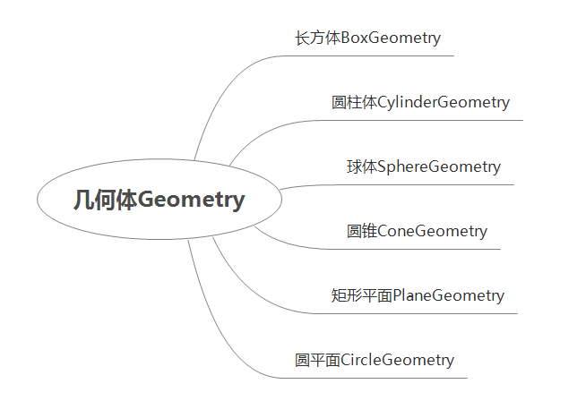
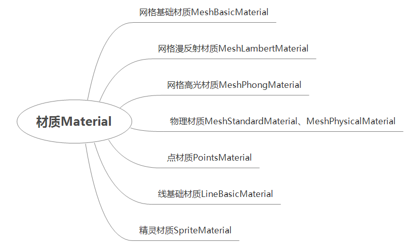

# Three.js

## 一、初识

1、three.js官网

[three](https://threejs.org/)

2、简介

Three.js 是一个开源的应用级 3D JavaScript 库，可以让开发者在网页上创建 3D 体验。Three.js 屏蔽了 WebGL的底层调用细节，让开发者能更快速的进行3D场景效果的开发。

3、应用场景

游戏开发、产品展示、物联网、数字孪生、智慧城市园区、机械仿真、建筑可视化、全景看房、地理信息系统

4、学习资料

[书籍](https://discoverthreejs.com/zh/)

[three中文网1](http://webgl3d.cn/)

[three中文网2](https://www.three3d.cn/)

[仓库地址](https://github.com/mrdoob/three.js)

## 二、快速入门

### 2.1 安装

```
npm install three@0.172.0 --save
```

### 2.2 初始化

#### 2.2.1创建一个场景

```js
import * as THREE from 'three'
export class World {
  constructor(container) {
    // 获取dom元素
    this.container = container
    // 获取dom元素的宽高
    this.width = this.container.clientWidth
    this.height = this.container.clientHeight
    // 初始化场景
    this.scene = new THREE.Scene()
    // 初始化相机
    this.camera = new THREE.PerspectiveCamera(45, this.width / this.height, 0.1, 1000)
    // 初始化渲染器
    this.renderer = new THREE.WebGLRenderer({
      antialias: true, // 渲染器锯齿属性
    })
    // 设置渲染器宽高
    this.renderer.setSize(this.width, this.height)
    // 将渲染器添加到dom元素中
    this.container.appendChild(this.renderer.domElement)
    // 监听窗口大小变化
    window.addEventListener('resize', this.resize.bind(this))
  }
  // 自适应窗口大小
  resize() {
    this.camera.aspect = this.container.clientWidth / this.container.clientHeight
    this.camera.updateProjectionMatrix()
    this.renderer.setSize(this.container.clientWidth, this.container.clientHeight)
    this.renderer.setPixelRatio(window.devicePixelRatio)
  }
  // 渲染(最后调用)
  render() {
    this.renderer.setPixelRatio(window.devicePixelRatio)
    this.renderer.render(this.scene, this.camera)
  }
}
const world = new World(document.body)
```

#### 2.2.2 创建几何体

```js
// 创建几何体
const geometry = new THREE.BoxGeometry(1, 1, 1)
// 创建材质
const material = new THREE.MeshBasicMaterial({ color: 0x00ff00 })
// 创建网格
const cube = new THREE.Mesh(geometry, material)
// 将网格添加到场景中
world.scene.add(cube)
```

#### 2.2.3 渲染

```js
// 设置相机位置
world.camera.position.z = 5
// 目标观察点
world.camera.lookAt(0, 0, 0)
// 渲染场景
function animate() {
  //  渲染下一帧的时候就会调用animate函数
  requestAnimationFrame(animate)
  // 旋转
  cube.rotation.x += 0.01
  cube.rotation.y += 0.01
  // 渲染
  world.renderer.render(scene, camera)
}
animate()
```

### 2.3 核心组件

#### 2.3.1[场景scene](https://threejs.org/docs/index.html?q=scene#api/zh/scenes/Scene)

场景scene是一个3D 笛卡尔坐标系，场景的中心是点(0,0,0)。每当我们创建一个新对象并将其添加到我们的场景中时，它将被放置在原点，three.js 中的大小单位是米。

#### 2.3.2相机camera

即投影方式，分为**透视投影[PerspectiveCamera](https://threejs.org/docs/index.html#api/zh/cameras/PerspectiveCamera)**、**正交投影[OrthographicCamera](https://threejs.org/docs/index.html#api/zh/cameras/OrthographicCamera)**

#### 2.3.3[渲染器renderer](https://threejs.org/docs/index.html#api/zh/renderers/WebGLRenderer)

如果场景是一个小宇宙，而相机是一个指向那个宇宙的望远镜，那么渲染器就是一个艺术家，他通过望远镜观察并将他们看到的东西 *非常快* 的绘制到一个`<canvas>`中去。

#### 2.3.4网格 Mesh

**[网格](https://threejs.org/docs/#api/en/objects/Mesh)是 3D 计算机图形学中最常见的可见对象**，用于显示各种 3D 对象——猫、狗、人类、树木、建筑物、花卉和山脉都可以使用网格来表示。还有其他种类的可见对象，例如线条、形状、精灵和粒子等。

```js
import * as THREE from 'three'
const geometry = new THREE.BoxGeometry(1, 1, 1);
const material = new THREE.MeshBasicMaterial({ color: 0x00ff00 });
const cube = new THREE.Mesh(geometry, material);
```

`Mesh`构造函数有两个参数：**几何**geometry和**材质**material

## 三、几何体与材质

### 3.1 几何体



#### 3.1.1 [立方缓冲几何体（BoxGeometry）](https://threejs.org/docs/index.html#api/zh/geometries/BoxGeometry)

#### 3.1.2 [球缓冲几何体（SphereGeometry）](https://threejs.org/docs/index.html#api/zh/geometries/SphereGeometry)

#### 3.1.3 [圆柱缓冲几何体（CylinderGeometry）](https://threejs.org/docs/index.html#api/zh/geometries/CylinderGeometry)

#### 3.1.4 [平面缓冲几何体（PlaneGeometry）](https://threejs.org/docs/index.html#api/zh/geometries/PlaneGeometry)

#### 3.1.5 [圆环缓冲几何体（TorusGeometry）](https://threejs.org/docs/index.html#api/zh/geometries/TorusGeometry)

3.1.6 [自定义几何体BufferGeometry](https://threejs.org/docs/index.html?q=BufferGeometry#api/zh/core/BufferGeometry)

### 3.2 材质



各种标准材质的构建速度从最快到最慢：MeshBasicMaterial ➡ MeshLambertMaterial ➡ MeshPhongMaterial ➡ MeshStandardMaterial ➡ MeshPhysicalMaterial。构建速度越慢的材质，做出的场景越逼真。

#### 3.2.1 [基础网格材质(MeshBasicMaterial)](https://threejs.org/docs/index.html#api/zh/materials/MeshBasicMaterial)

这种材质不受光照的影响

#### 3.2.2 [漫反射材质（MeshLambertMaterial）](https://threejs.org/docs/index.html#api/zh/materials/MeshLambertMaterial)

一种非光泽表面的材质，没有镜面高光,这可以很好地模拟一些表面（例如未经处理的木材或石材），但不能模拟具有镜面高光的光泽表面（例如涂漆木材）

#### 3.2.3 [高光材质（MeshPhongMaterial）](https://threejs.org/docs/index.html#api/zh/materials/MeshPhongMaterial)

该材质可以模拟具有镜面高光的光泽表面（例如涂漆木材）

#### 3.2.4 [物理网格材质(MeshPhysicalMaterial)](https://threejs.org/docs/index.html?q=MeshPhysicalMaterial#api/zh/materials/MeshPhysicalMaterial)

- **各向异性(Anisotropy):** 能够表现出拉丝金属所观察到的材料的各向异性特性。
- **清漆(Clearcoat):** 有些类似于车漆，碳纤，被水打湿的表面的材质需要在面上再增加一个透明的，具有一定反光特性的面。而且这个面说不定有一定的起伏与粗糙度。Clearcoat 可以在不需要重新创建一个透明的面的情况下做到类似的效果。
- **虹彩(Iridescence):** 允许渲染色调根据视角和照明角度而变化的效果。这可以在肥皂泡、油膜或许多昆虫的翅膀上看到。
- **基于物理的透明度**:[.opacity](https://threejs.org/docs/index.html#api/zh/materials/Material.opacity)属性有一些限制:在透明度比较高的时候，反射也随之减少。使用基于物理的透光性[.transmission](https://threejs.org/docs/index.html#api/zh/materials/MeshPhysicalMaterial.transmission)属性可以让一些很薄的透明表面，例如玻璃，变得更真实一些。
- **高级光线反射:** 为非金属材质提供了更多更灵活的光线反射。
- **光泽(Sheen):** 可用于表示布料和织物材料。

物理网格材质使用了更复杂的着色器功能，所以在每个像素的渲染都要比three.js中的其他材质更费性能，大部分的特性是默认关闭的，需要手动开启，每开启一项功能在开启的时候才会更耗性能。请注意，为获得最佳效果，您在使用此材质时应始终指定[environment map](https://threejs.org/docs/index.html#api/zh/materials/MeshPhysicalMaterial.envMap)。

#### 3.2.5 [着色器材质(ShaderMaterial)](https://threejs.org/docs/index.html#api/zh/materials/ShaderMaterial)

## 四、光照与阴影

### 4.1 光源类型

#### 4.1.1 [环境光（AmbientLight）](https://threejs.org/docs/index.html#api/zh/lights/AmbientLight)

环境光会均匀的照亮场景中的所有物体,不会产生阴影。

#### 4.1.2 [点光源（PointLight）](https://threejs.org/docs/index.html#api/zh/lights/PointLight)

一个点向各个方向发射的光源。一个常见的例子是模拟一个灯泡发出的光，产生阴影。

#### 4.1.3 [平行光（DirectionalLight）](https://threejs.org/docs/index.html#api/zh/lights/DirectionalLight)

平行光是沿着特定方向发射的光。这种光的表现像是无限远，从它发出的光线都是平行的。常常用平行光来模拟太阳光的效果。 太阳足够远，因此我们可以认为太阳的位置是无限远，所以我们认为从太阳发出的光线也都是平行的，产生阴影。

#### 4.1.4 [聚光灯（SpotLight）](https://threejs.org/docs/index.html#api/zh/lights/SpotLight)

光线从一个点沿一个方向射出，随着光线照射的变远，光线圆锥体的尺寸也逐渐增大。

### 4.2 阴影

渲染器启用阴影（renderer.shadowMap.enabled）

## 五、相机与控制

## 六、动画与交互

## 七、加载器与资源

## 八、性能优化

## 辅助器

### 3.1 坐标辅助器

坐标辅助器，红色为x轴，绿色为y轴，蓝色为z轴,[详见](https://threejs.org/docs/index.html#api/zh/helpers/ArrowHelper)

```js
// AxesHelper：辅助观察的坐标系，参数为坐标长度
const axesHelper = new THREE.AxesHelper(150)
scene.add(axesHelper)
```

### 3.2 轨道控制器

轨道控制器，[详见](https://threejs.org/docs/index.html#examples/zh/controls/OrbitControls)

```js
// 导入轨道控制器
import { OrbitControls } from 'three/addons/controls/OrbitControls.js'
// 添加轨道控制器
const controls = new OrbitControls(camera, renderer.domElement)
// 设置带阻尼的惯性
controls.enableDamping = true
// 设置阻尼系数
controls.dampingFactor = 0.05
// 设置转动速度
controls.autoRotate = true
// 更新控制器。必须在摄像机的变换发生任何手动改变后调用
controls.update()
```

### 3.2 几何体基本操作

[详见](https://threejs.org/docs/index.html#api/zh/core/Object3D)

① 物体位移与缩放

```js
// 创建网格
const cube = new THREE.Mesh(geometry, material)
// 几何体的位移
// cube.position.y = 2
cube.position.set(2, 0, 0)
// 缩放
cube.scale.set(2,2,2)
```

② 父子元素

```js
// 创建父元素
const faCube = new THREE.Mesh(geometry, material)
// 创建子元素
const cube = new THREE.Mesh(geometry, material)
// 将子元素添加到父元素中
faCube.add(cube)
// 将网格添加到场景中
scene.add(faCube)
```

注意：子元素的坐标相对于父元素的坐标

③ 物体旋转

```js
//直接设置旋转属性，例如围绕x轴旋转90度
cube.rotation.x = -Math.PI/2
//围绕x轴旋转45度
cube.rotation.set(-Math.PI / 4, 0, 0, "XZY");
```

### 3.3 屏幕自适应

① 自适应屏幕大小

```js
// 监听画面变化，更新渲染画面
window.addEventListener('resize', () => {
  // 更新摄像头
  camera.aspect = window.innerWidth / window.innerHeight
  // 更新摄像机的投影矩阵
  camera.updateProjectionMatrix()

  // 更新渲染器
  renderer.setSize(window.innerWidth, window.innerHeight)
  // 设置渲染器的像素比
  renderer.setPixelRatio(window.devicePixelRatio)
})
```

②  控制场景全屏

```js
window.addEventListener("dblclick", () => {
  const fullScreenElement = document.fullscreenElement;
  if (!fullScreenElement) {
    //   双击控制屏幕进入全屏，退出全屏
    // 让画布对象全屏
    renderer.domElement.requestFullscreen();
  } else {
    //   退出全屏，使用document对象
    document.exitFullscreen();
  }
});
```

### 3.4 调试器与编辑器

① 调试器 -gui：可以快速创建控制三维场景的UI交互界面，[详见](https://lil-gui.georgealways.com)

② 编辑器 https://threejs.org/editor/

## [三维物体](https://threejs.org/docs/index.html#api/zh/core/Object3D)


## 几何体

### 4.1 创建几何体

**缓冲类型几何体`BufferGeometry`**：矩形平面`PlaneGeometry`、长方体`BoxGeometry`、球体`SphereGeometry`都是基于[BufferGeometry (opens new window)](https://threejs.org/docs/index.html?q=BufferGeometry#api/zh/core/BufferGeometry)类构建的。

1. 创建一个空的几何体

   ```js
   const geometry = new THREE.BufferGeometry()
   ```

2. 创建几何体顶点并设置顶点属性

   ```js
   // 创建顶点数据32位浮点数数组,tips:顶点是有顺序的，逆时针为正面
   const vertices = new Float32Array([
     -1.0,-1.0,0.0, // 第一个点的xyz轴位置
     1.0,-1.0,0.0, // 第二个点的xyz轴位置
     1.0,1.0,0.0, // 第三个点的xyz轴位置
     -1.0,1.0,0.0 // 第四个点的xyz轴位置
   ])
   // 设置顶点属性
   geometry.attributes.position = new THREE.BufferAttribute(vertices, 3)
   ```

3. 创建索引(顶点位置)数组--用于顶点复用(合并)

   ```js
   const indices = new Uint16Array([0, 1, 2, 2, 3, 0])
   geometry.setIndex(new THREE.BufferAttribute(indices, 1))
   ```

### 4.2 模型渲染

- 点模型

  ```js
  const pointsMaterial = new THREE.PointsMaterial({
    color: 0xffff00,
    size: 0.1, //点对象像素尺寸
  })
  const points = new THREE.Points(geometry, pointsMaterial) //点模型对象
  ```

- 线模型

  ```js
  const lineMaterial = new THREE.LineBasicMaterial({ color: 0x00ff00 }) //线模型材质
  const line = new THREE.Line(geometry, lineMaterial) //线模型对象
  // const line = new THREE.LineLoop(geometry, lineMaterial) // 闭合线条
  // const line = new THREE.LineSegments(geometry, lineMaterial)// 非连续的线条
  ```

- 网格模型

  ```js
  const meshMaterial = new THREE.MeshBasicMaterial({
    color: 0x00ff00,
    // side: THREE.FrontSide, //默认只有正面可见
    side: THREE.DoubleSide, // 双面显示
    // side: THREE.BackSide, //设置只有背面可见
    wireframe: true, // 线框模式
  })
  const mesh = new THREE.Mesh(geometry, meshMaterial)
  ```

### [4.3 常见几何体](https://threejs.org/docs/index.html#api/zh/geometries/BoxGeometry)

## 材质

## 贴图